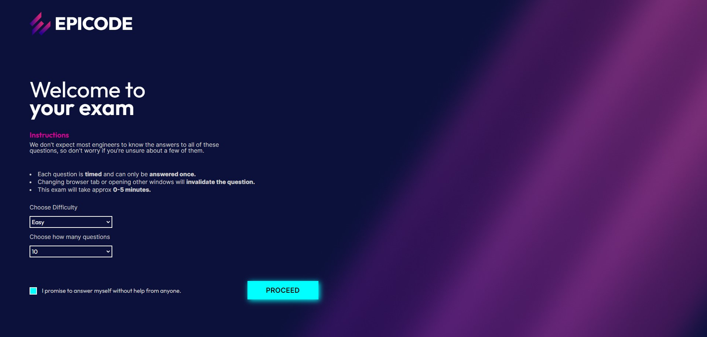
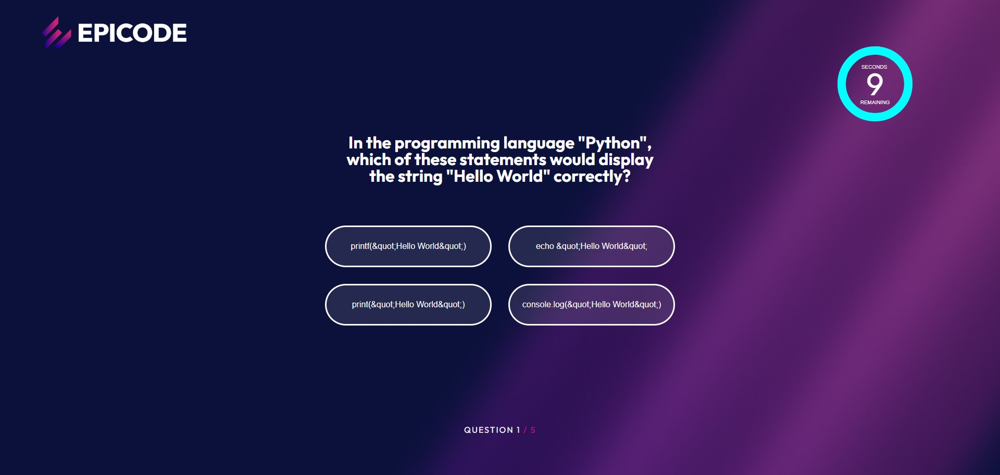
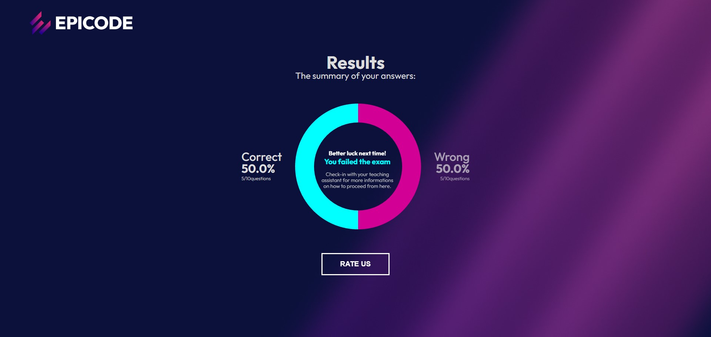

<h1> Benchmark Simulator IT - README </h1>

Benvenuti nel Benchmark Simulator IT, un progetto sviluppato durante la Build Week 1 dal nostro eccezionale team. Questa piattaforma interattiva consente agli utenti di generare quiz a tema informatico, personalizzati secondo le proprie preferenze.

<b>Funzionalità Principali:</b>

<b>Generazione di Quiz Personalizzati</b>: Gli utenti possono selezionare il numero di domande e il livello di complessità desiderati per il quiz. Questa flessibilità consente un'esperienza su misura per ogni utente, sia che si tratti di principianti o esperti.

<b>Domande Tematiche Informatiche</b>: Il nostro database offre una vasta gamma di domande riguardanti diversi aspetti dell'informatica, dalla programmazione alla sicurezza informatica, dalle reti alla storia dell'informatica. Gli utenti avranno accesso a una varietà di argomenti stimolanti.

<b>Valutazione del Quiz in Percentuale</b>: Alla fine del quiz, gli utenti riceveranno un punteggio espresso in percentuale, che riflette la loro performance. Questo permette loro di valutare il proprio livello di conoscenza e identificare eventuali aree in cui possono migliorare.

Come Usare:

<b>Seleziona le Opzioni del Quiz</b>: All'avvio, l'utente sarà guidato attraverso un processo intuitivo per selezionare il numero di domande e la complessità desiderata.

<b>Rispondi alle Domande</b>: Una volta avviato il quiz, rispondi alle domande fornite. Assicurati di leggere attentamente ogni domanda e selezionare la risposta corretta.

<b>Visualizza il Risultato</b>: Alla fine del quiz, verrà visualizzato il tuo punteggio in percentuale insieme a un breve resoconto della tua performance.

Crediti:

Il Quiz Generator IT è stato sviluppato con amore da <a href="https://www.linkedin.com/in/trixiamarielorenzana/" target="_blank">Trixia Marie Lorenzana </a>, <a  href="https://github.com/0znerol" target="_blank">Lorenzo Pezzica </a>, <a  href="https://www.linkedin.com/in/simone-tonti/" target="_blank">Simone Tonti</a>, <a  href="https://github.com/JessIaco" target="_blank">Jessica Iacovelli</a>, <a href="https://www.linkedin.com/in/boschettoandrea/" target="_blank">Andrea Boschetto</a> e <a  href="https://www.linkedin.com/in/celine-fatima-emanuele-webdeveloper/" target="_blank">Celine Emanuele</a>.
